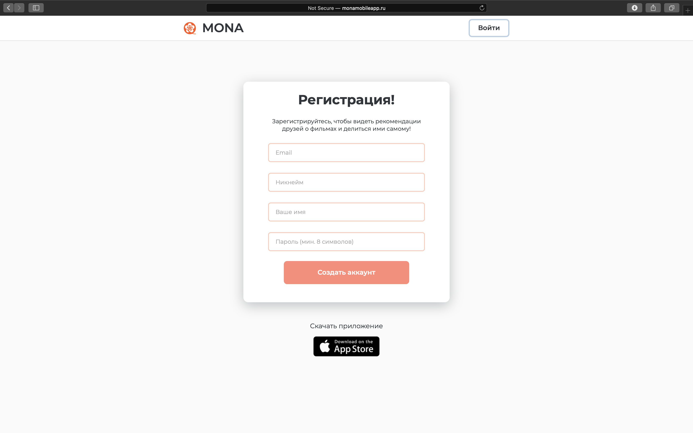
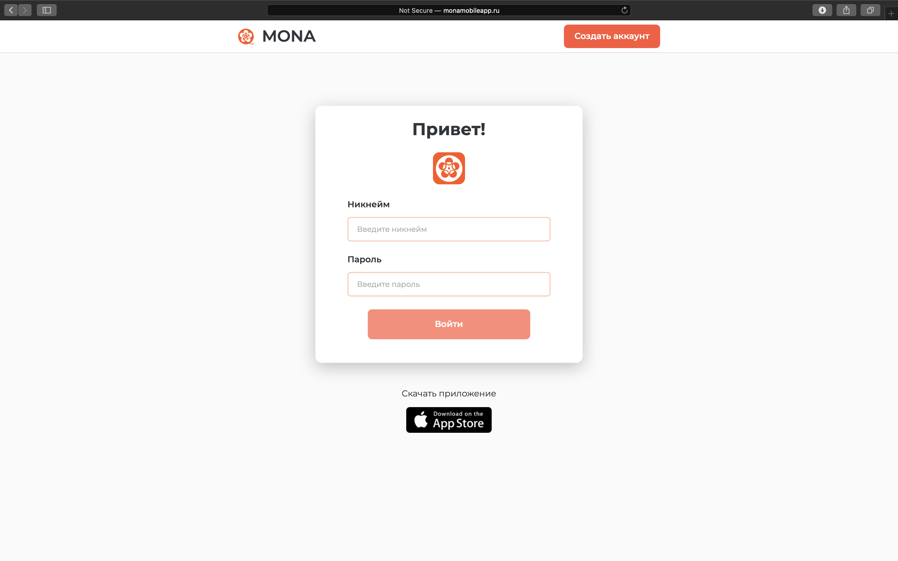
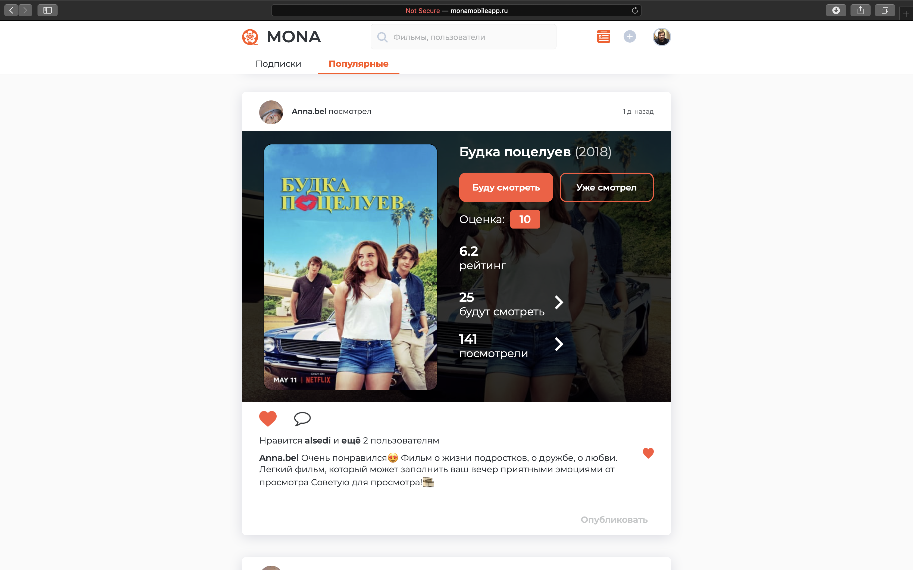
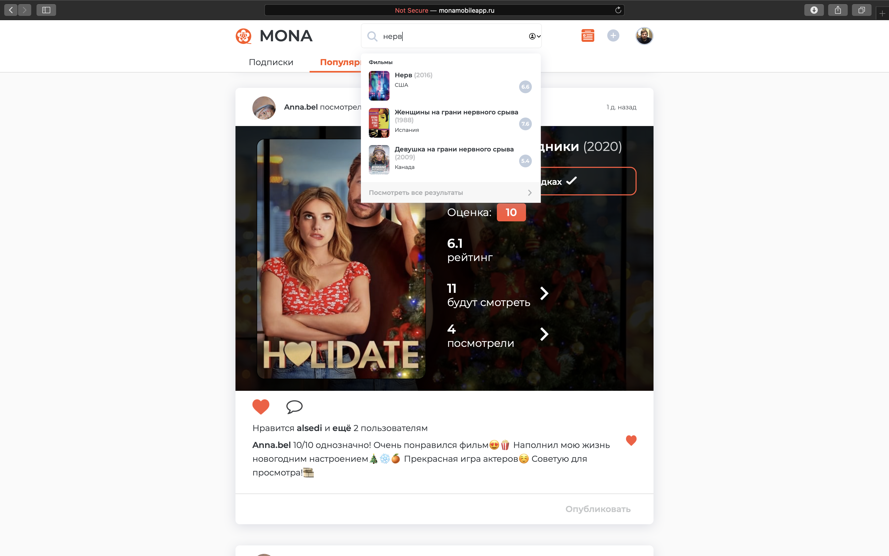

# MonaWeb
MONA — социальная сеть про кино!
 
 
Главная функция приложения — лента фильмов пользователей, на которых ты подписан. Листая ленту, ты можешь найти крутые фильмы для просмотра, почитать отзывы, добавлять фильмы в закладки или делиться ими со своими подписчиками.

Параллельно ты можешь вести свою коллекцию просмотренных фильмов и рекомендовать их другим.

Мы рады обратной связи, если у вас есть отзывы или комментарии по работе приложения, напишите нам!

 
 

  

  <i>Начальная страница</i>

 
 

  

  <i>Регистрация</i>

 
 

  

  <i>Авторизация</i>

 
 

  

  <i>Лента</i>

 
 

  

  <i>Поиск фильмов/пользователей</i>

 
 

  

  <i>Результат поиска</i>

 
 

  

  <i>Профиль пользователя - Публикации</i>

 
 

  

  <i>Профиль пользователя - В закладках</i>

 
 

  

  <i>Профиль пользователя - Просмотрено</i>

 
 

  

  <i>Карточка фильма</i>

 
 

  

  <i>Карточка фильма - Медиа</i>

 
 

  

  <i>Карточка фильма - Трейлеры</i>

 
 

  

  <i>Карточка фильма - Кадры</i>

 
 

  

  <i>Создание публикации</i>

 
 

  

  <i>Создание публикации - Буду смотреть</i>

 
 

  

  <i>Создание публикации - Уже смотрел</i>

